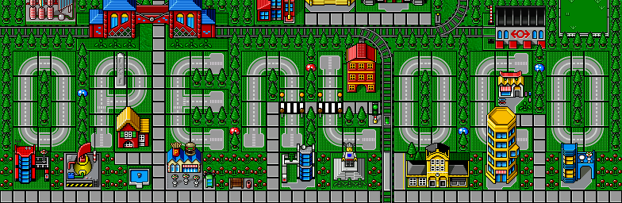

# Openloco



This is a still very much work in progress reimplementation of Lego Loco. 

```
cmake -DCMAKE_BUILD_TYPE=DEBUG -S . -B build
make -C build
./build/openloco
```

## Todo

- [ ] Minifig behavior
- [ ] Trains
- [ ] Toolbox
- [ ] Editor
- [ ] Sound
- [ ] Events
